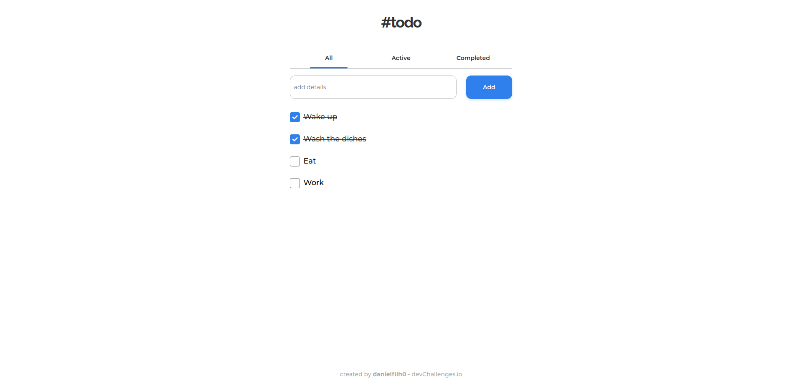

<h1 align="center">#todo 📌</h1> 

<div align="center">
   Solution for a challenge from  <a href="http://devchallenges.io" target="_blank">Devchallenges.io</a>.
</div>
<br />

<div align="center">
  <h3>
    <a href="https://df-todolist.vercel.app/">
      Demo
    </a>
    <span> | </span>
    <a href="https://devchallenges.io/solutions/6xKKPNrTaFAt7bDNy2uS">
      Solution
    </a>
    <span> | </span>
    <a href="https://devchallenges.io/challenges/hH6PbOHBdPm6otzw2De5">
      Challenge
    </a>
  </h3>
</div>

<!-- TABLE OF CONTENTS -->

## ✅ Table of Contents

- [✅ Table of Contents](#-table-of-contents)
- [✅ Overview](#-overview)
  - [👉 Built With](#-built-with)
- [✅ Features](#-features)
- [✅ How To Use](#-how-to-use)
- [✅ Contact](#-contact)

## ✅ Overview



### 👉 Built With

- [React](https://reactjs.org/)
- [Sass](https://sass-lang.com/)

## ✅ Features

- [X] I can add a new task
- [X] I can complete a task
- [X] I can toggle between All, Active and Completed
- [X] I can remove one or all tasks under the Completed tab
- [X] Store the data in local storage that when I refresh the page I can still see my progress

This application/site was created as a submission to a [DevChallenges](https://devchallenges.io/challenges) challenge. The [challenge](https://devchallenges.io/challenges/hH6PbOHBdPm6otzw2De5) was to build an application to complete the given user stories.

## ✅ How To Use

To clone and run this application, you'll need [Git](https://git-scm.com) and [Node.js](https://nodejs.org/en/download/) (which comes with [npm](http://npmjs.com)) installed on your computer. From your command line:

```bash
# Clone this repository
$ git clone https://github.com/danielfilh0/todo-list

# Install dependencies
$ yarn install

# Run the app
$ yarn start
```

## ✅ Contact

- GitHub [@danielfilh0](https://github.com/danielfilh0)
- Linkedin [@danielfilh0](https://www.linkedin.com/in/danielfilh0/)
